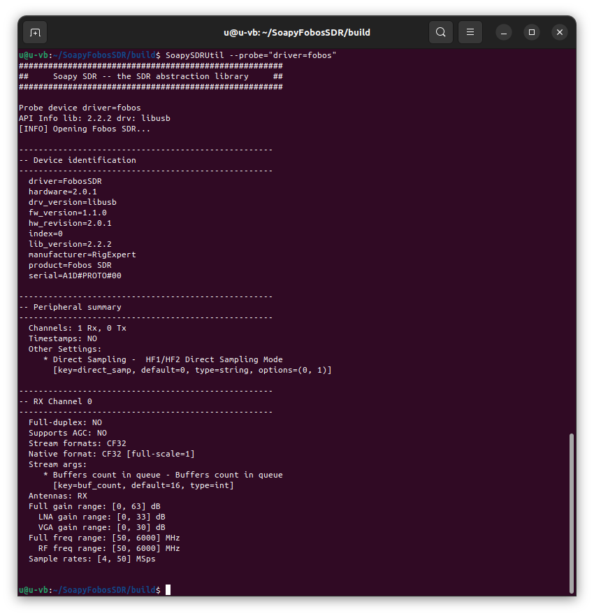
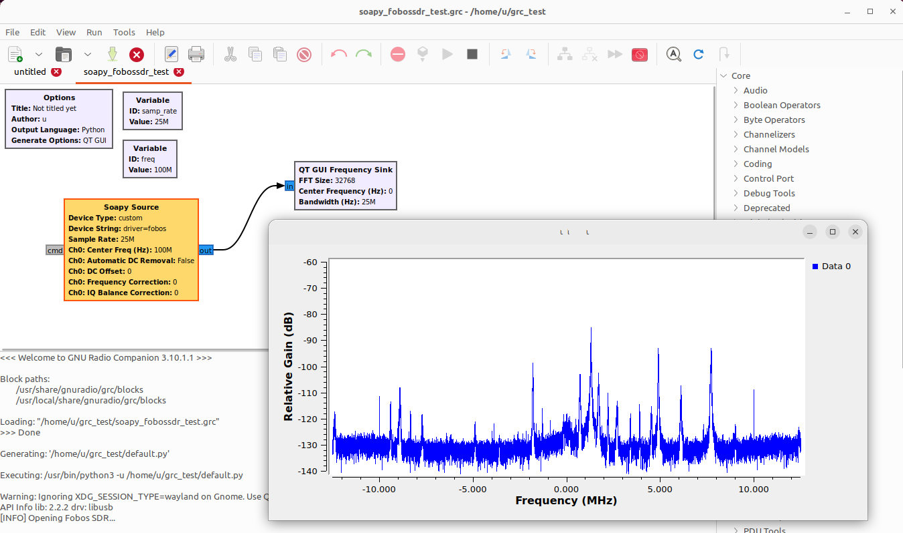

# Soapy SDR plugin for Fobos SDR

This is the Soapy SDR plugin wrapper for Fobos SDR receiver API shared library. Full source code.


## Versions and compatibility

See [versions.txt](versions.txt)

## Platforms tested on

- Linux (Ubuntu 22.04 LTS ...)
- Windows (7, 8.1, 10, 11) x64

## Requirements

- git v.2.31 or later (otherwise download the repository manualy: Code->Download ZIP)
- any **c++** compiler (tested on gcc, g++, mingw, msvc) 

## Dependencies

* SoapySDR - https://github.com/pothosware/SoapySDR/
* libfobos - https://github.com/rigexpert/libfobos/

## How to build and install

### Linux
```
git clone [this repo]
cd SoapyFobosSDR
mkdir build
cd build
cmake ..
make
subo make install
sudo ldconfig
```
### Windows
```
git clone [this repo]
cd SoapyFobosSDR
mkdir build
cd build
cmake ..
```
Visit https://github.com/rigexpert/libfobos/releases<br />
Download any libfobos release .zip pack, for example  libfobos-2.2.2.zip<br />
Unpack content to **libfobos** directory<br />
```
cmake --build . --config Release
```
or<br />
open **fobos.sln** in your favorite **MS VisualStudio IDE**, build, debug, trace, evaluate, enjoy.<br />

## Check with SoapySDRUtil
```
SoapySDRUtil --probe="driver=fobos"
```

<br />

## Test with GNU Radio

See [soapy_fobossdr_test.grc](test/soapy_fobossdr_test.grc)

<br />


## What is actually Fobos SDR

For more info visit the main product page

https://rigexpert.com/en/products/kits-en/fobos-sdr/
